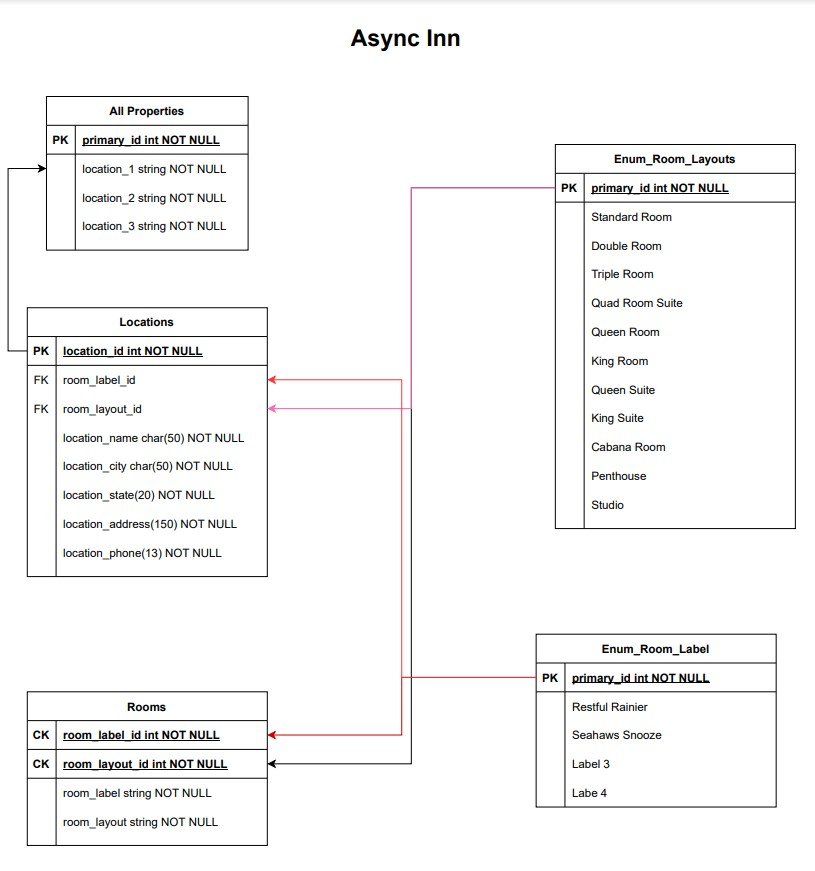
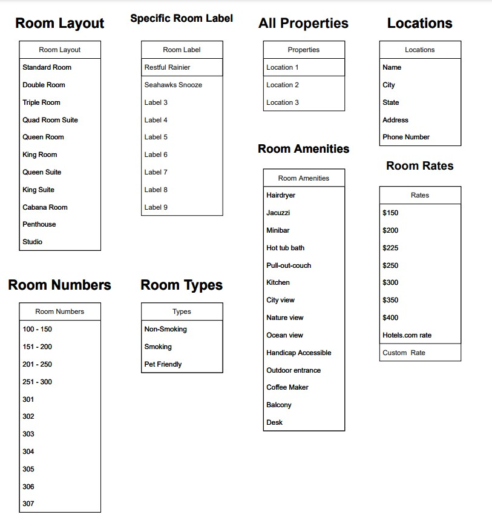

# Async-Inn
Lab 11 to build a database of hotel properties with amenities, etc.

Welcome to the Async Inn!  You will be able to see our different locations, rooms, amenities, etc.

##  Yvette Clapp
##  October 18, 2021

###  ERD Image

###  Tables and definitions

-  All  Properties - this will be the list of the hotel property and ID
-  Locations - this will be the table that contains the individual property specifics
    -  Name
    -  City
    -  State
    -  Address
    -  Phone Number
    -  ID
-  Room Layout - this is the list of room styles that the locations may have.  Example:  Standard Room, Queen Suite, Penthouse, etc.
-  Specific Room Label - this the name given to the actual room, such as Restful Ranier and Seahawks Snooze
-  Room Amenities - this list includes items associated with rooms such as Hairdryer, Ocean view, handicap accessible, Coffee maker, Pull-out couch, etc.
-  Room Types - includes smoking, non-smoking, and pet friendly
-  Room Numbers - provides a few generic ranges and the specific custom suites that each location uses the same room number for
-  Room Rates - again, similar with generic amounts, but then also a Hotels.com rate and a custom rate

### 10/21/2021 Update
Completed refactoring the hotels.  After that, I moved on to refactoring the amenities and rooms.  All of the refactoring is done, except the delete for the amenities controller.

### 10/25/2021 Update
Updated indenting and updated some names to keep them consistent.  Started adding the DTO.

### Updated 10/21/2021

